## Сделано
1) Patroni кластер (master + async replica) на etcd (3 хоста)
2) Debezium коннекторы к patroni-master (kafka + zookeeper(3 хоста)) 
3) DMP-service для перекладки данных из топиков kafka в staging
4) Хранилище MinIO (S3)
5) БД Iceberg (Postgres) для хранения реестра S3
6) Контроллер iceberg
7) Trino для управления запросами
8) Контейнер trino-init для создания схем данных staging и detailed (через выполнение DDL скриптов) 
9) SQL-скрипт + контейнер для перекладки staging -> detailed (sql\load_staging_to_detailed.sql)

## Команды
### Сборка и запуск
```shell
docker-compose up -d
```
### Остановка
```shell
docker-compose down -v
```
### Запустить перенос staging -> detailed
```shell
docker compose run --rm staging-to-detailed
```

### Генерация DDL скриптов по схеме
```shell
pip install pyyaml
python scripts/generate_source_ddl.py
python scripts/generate_staging_ddl.py
python scripts/generate_detailed_ddl.py
```

## Connection string (в формате jdbc, проверяла в DBeaver)
### Postgres Master (user=postgres,password=postgres)
1) jdbc:postgresql://localhost:5432/logistics_service_db?user=postgres&password=postgres
2) jdbc:postgresql://localhost:5432/order_service_db?user=postgres&password=postgres
3) jdbc:postgresql://localhost:5432/user_service_db?user=postgres&password=postgres

### Postgres Replica (user=postgres,password=postgres)
1) jdbc:postgresql://localhost:6432/logistics_service_db?user=postgres&password=postgres
2) jdbc:postgresql://localhost:6432/order_service_db?user=postgres&password=postgres
3) jdbc:postgresql://localhost:6432/user_service_db?user=postgres&password=postgres

### Trino (staging/detailed)
jdbc:trino://localhost:8088/iceberg/default?user=dmp

##  ER-диаграмма для detailed (Data Vault 2)

```mermaid
erDiagram
  HUB_USER ||--o{ SAT_USER : has
  HUB_ADDRESS ||--o{ SAT_ADDRESS : has
  HUB_USER ||--o{ LNK_ADDRESS_USER : links
  HUB_ADDRESS ||--o{ LNK_ADDRESS_USER : links

  HUB_ORDER ||--o{ SAT_ORDER : has
  HUB_PRODUCT ||--o{ SAT_PRODUCT : has
  HUB_ORDER ||--o{ LNK_ORDER_USER : links
  HUB_USER ||--o{ LNK_ORDER_USER : links
  HUB_ORDER ||--o{ LNK_ORDER_ADDRESS : links
  HUB_ADDRESS ||--o{ LNK_ORDER_ADDRESS : links

  HUB_SHIPMENT ||--o{ SAT_SHIPMENT : has
  HUB_WAREHOUSE ||--o{ SAT_WAREHOUSE : has
  HUB_PICKUP_POINT ||--o{ SAT_PICKUP_POINT : has
  HUB_SHIPMENT ||--o{ LNK_SHIPMENT_ORDER : links
  HUB_ORDER ||--o{ LNK_SHIPMENT_ORDER : links
  HUB_SHIPMENT ||--o{ LNK_SHIPMENT_WAREHOUSE : links
  HUB_WAREHOUSE ||--o{ LNK_SHIPMENT_WAREHOUSE : links
  HUB_SHIPMENT ||--o{ LNK_SHIPMENT_PICKUP_POINT : links
  HUB_PICKUP_POINT ||--o{ LNK_SHIPMENT_PICKUP_POINT : links

  HUB_USER {
    varchar hk PK
    uuid bk_user_external_id
    timestamp load_dts
    varchar record_source
  }

  SAT_USER {
    varchar hk_user FK
    varchar hashdiff
    timestamp effective_from
    timestamp effective_to
    boolean is_current
    timestamp load_dts
    varchar record_source
  }

  HUB_ADDRESS {
    varchar hk PK
    uuid bk_address_external_id
    timestamp load_dts
    varchar record_source
  }

  SAT_ADDRESS {
    varchar hk_address FK
    varchar hashdiff
    timestamp effective_from
    timestamp effective_to
    boolean is_current
    timestamp load_dts
    varchar record_source
  }

  LNK_ADDRESS_USER {
    varchar hk_link PK
    varchar hk_address FK
    varchar hk_user FK
    timestamp load_dts
    varchar record_source
  }

  HUB_ORDER {
    varchar hk PK
    uuid bk_order_external_id
    timestamp load_dts
    varchar record_source
  }

  SAT_ORDER {
    varchar hk_order FK
    varchar hashdiff
    timestamp effective_from
    timestamp effective_to
    boolean is_current
    timestamp load_dts
    varchar record_source
  }

  HUB_PRODUCT {
    varchar hk PK
    varchar bk_product_sku
    timestamp load_dts
    varchar record_source
  }

  SAT_PRODUCT {
    varchar hk_product FK
    varchar hashdiff
    timestamp effective_from
    timestamp effective_to
    boolean is_current
    timestamp load_dts
    varchar record_source
  }

  LNK_ORDER_USER {
    varchar hk_link PK
    varchar hk_order FK
    varchar hk_user FK
    timestamp load_dts
    varchar record_source
  }

  LNK_ORDER_ADDRESS {
    varchar hk_link PK
    varchar hk_order FK
    varchar hk_address FK
    timestamp load_dts
    varchar record_source
  }

  HUB_SHIPMENT {
    varchar hk PK
    uuid bk_shipment_external_id
    timestamp load_dts
    varchar record_source
  }

  SAT_SHIPMENT {
    varchar hk_shipment FK
    varchar hashdiff
    timestamp effective_from
    timestamp effective_to
    boolean is_current
    timestamp load_dts
    varchar record_source
  }

  HUB_WAREHOUSE {
    varchar hk PK
    varchar bk_warehouse_code
    timestamp load_dts
    varchar record_source
  }

  SAT_WAREHOUSE {
    varchar hk_warehouse FK
    varchar hashdiff
    timestamp effective_from
    timestamp effective_to
    boolean is_current
    timestamp load_dts
    varchar record_source
  }

  HUB_PICKUP_POINT {
    varchar hk PK
    varchar bk_pickup_point_code
    timestamp load_dts
    varchar record_source
  }

  SAT_PICKUP_POINT {
    varchar hk_pickup_point FK
    varchar hashdiff
    timestamp effective_from
    timestamp effective_to
    boolean is_current
    timestamp load_dts
    varchar record_source
  }

  LNK_SHIPMENT_ORDER {
    varchar hk_link PK
    varchar hk_shipment FK
    varchar hk_order FK
    timestamp load_dts
    varchar record_source
  }

  LNK_SHIPMENT_WAREHOUSE {
    varchar hk_link PK
    varchar hk_shipment FK
    varchar hk_warehouse FK
    timestamp load_dts
    varchar record_source
  }

  LNK_SHIPMENT_PICKUP_POINT {
    varchar hk_link PK
    varchar hk_shipment FK
    varchar hk_pickup_point FK
    timestamp load_dts
    varchar record_source
  }
```
