## Сделано (все пункты + бонусы)
1) Patroni кластер (master + async replica) на etcd (3 хоста)
2) Debezium коннекторы к patroni-master (kafka + zookeeper(3 хоста)) 
3) DMP-service для перекладки данных из топиков kafka в staging
4) Хранилище MinIO (S3)
5) БД Iceberg (Postgres) для хранения реестра S3
6) Контроллер iceberg
7) Trino для управления запросами
8) Контейнер trino-init для создания схем данных staging и detailed (через выполнение DDL скриптов) 
9) SQL-скрипт + контейнер для перекладки staging -> detailed (sql\load_staging_to_detailed.sql)
10) Python скрипты(scripts/generate_source_ddl.py, scripts/generate_staging_ddl.py, scripts/generate_detailed_ddl.py) для создания DDL source, staging и detailed слоев по конфигурационному файлу schema/config.yml 

## Команды
### Сборка и запуск
```shell
docker-compose up -d
```
### Остановка
```shell
docker-compose down -v
```
### Запустить перенос staging -> detailed
```shell
docker compose run --rm staging-to-detailed
```

### Генерация DDL скриптов по схеме
```shell
pip install pyyaml
python scripts/generate_source_ddl.py
python scripts/generate_staging_ddl.py
python scripts/generate_detailed_ddl.py
```
1) scripts/generate_source_ddl.py - скрипт генерации DDL скрипта для слоя источника (Postgres). Выходные данные в initdb/source
2) scripts/generate_staging_ddl.py - скрипт генерации DDL скрипта для слоя staging (Trino + iceberg). Выходные данные в initdb/staging
3) scripts/generate_detailed_ddl.py - скрипт генерации DDL скрипта для слоя detailed (Trino + iceberg). Выходные данные в initdb/detailed

## Connection string (в формате jdbc, проверяла в DBeaver)
### Postgres Master (user=postgres,password=postgres)
1) jdbc:postgresql://localhost:5432/logistics_service_db?user=postgres&password=postgres
2) jdbc:postgresql://localhost:5432/order_service_db?user=postgres&password=postgres
3) jdbc:postgresql://localhost:5432/user_service_db?user=postgres&password=postgres

### Postgres Replica (user=postgres,password=postgres)
1) jdbc:postgresql://localhost:6432/logistics_service_db?user=postgres&password=postgres
2) jdbc:postgresql://localhost:6432/order_service_db?user=postgres&password=postgres
3) jdbc:postgresql://localhost:6432/user_service_db?user=postgres&password=postgres

### Trino (staging/detailed)
jdbc:trino://localhost:8088/iceberg/default?user=dmp

## 
##  ER-диаграмма для detailed (Data Vault 2)

```mermaid
erDiagram
  HUB_USER ||--o{ SAT_USER : has
  HUB_ADDRESS ||--o{ SAT_ADDRESS : has
  HUB_USER ||--o{ LNK_ADDRESS_USER : links
  HUB_ADDRESS ||--o{ LNK_ADDRESS_USER : links

  HUB_ORDER ||--o{ SAT_ORDER : has
  HUB_PRODUCT ||--o{ SAT_PRODUCT : has
  HUB_ORDER ||--o{ LNK_ORDER_USER : links
  HUB_USER ||--o{ LNK_ORDER_USER : links
  HUB_ORDER ||--o{ LNK_ORDER_ADDRESS : links
  HUB_ADDRESS ||--o{ LNK_ORDER_ADDRESS : links

  HUB_SHIPMENT ||--o{ SAT_SHIPMENT : has
  HUB_WAREHOUSE ||--o{ SAT_WAREHOUSE : has
  HUB_PICKUP_POINT ||--o{ SAT_PICKUP_POINT : has
  HUB_SHIPMENT ||--o{ LNK_SHIPMENT_ORDER : links
  HUB_ORDER ||--o{ LNK_SHIPMENT_ORDER : links
  HUB_SHIPMENT ||--o{ LNK_SHIPMENT_WAREHOUSE : links
  HUB_WAREHOUSE ||--o{ LNK_SHIPMENT_WAREHOUSE : links
  HUB_SHIPMENT ||--o{ LNK_SHIPMENT_PICKUP_POINT : links
  HUB_PICKUP_POINT ||--o{ LNK_SHIPMENT_PICKUP_POINT : links

  HUB_USER {
    varchar hk PK
    uuid bk_user_external_id
    timestamp load_dts
    varchar record_source
  }

  SAT_USER {
    varchar hk_user FK
    varchar hashdiff
    timestamp effective_from
    timestamp effective_to
    boolean is_current
    timestamp load_dts
    varchar record_source
  }

  HUB_ADDRESS {
    varchar hk PK
    uuid bk_address_external_id
    timestamp load_dts
    varchar record_source
  }

  SAT_ADDRESS {
    varchar hk_address FK
    varchar hashdiff
    timestamp effective_from
    timestamp effective_to
    boolean is_current
    timestamp load_dts
    varchar record_source
  }

  LNK_ADDRESS_USER {
    varchar hk_link PK
    varchar hk_address FK
    varchar hk_user FK
    timestamp load_dts
    varchar record_source
  }

  HUB_ORDER {
    varchar hk PK
    uuid bk_order_external_id
    timestamp load_dts
    varchar record_source
  }

  SAT_ORDER {
    varchar hk_order FK
    varchar hashdiff
    timestamp effective_from
    timestamp effective_to
    boolean is_current
    timestamp load_dts
    varchar record_source
  }

  HUB_PRODUCT {
    varchar hk PK
    varchar bk_product_sku
    timestamp load_dts
    varchar record_source
  }

  SAT_PRODUCT {
    varchar hk_product FK
    varchar hashdiff
    timestamp effective_from
    timestamp effective_to
    boolean is_current
    timestamp load_dts
    varchar record_source
  }

  LNK_ORDER_USER {
    varchar hk_link PK
    varchar hk_order FK
    varchar hk_user FK
    timestamp load_dts
    varchar record_source
  }

  LNK_ORDER_ADDRESS {
    varchar hk_link PK
    varchar hk_order FK
    varchar hk_address FK
    timestamp load_dts
    varchar record_source
  }

  HUB_SHIPMENT {
    varchar hk PK
    uuid bk_shipment_external_id
    timestamp load_dts
    varchar record_source
  }

  SAT_SHIPMENT {
    varchar hk_shipment FK
    varchar hashdiff
    timestamp effective_from
    timestamp effective_to
    boolean is_current
    timestamp load_dts
    varchar record_source
  }

  HUB_WAREHOUSE {
    varchar hk PK
    varchar bk_warehouse_code
    timestamp load_dts
    varchar record_source
  }

  SAT_WAREHOUSE {
    varchar hk_warehouse FK
    varchar hashdiff
    timestamp effective_from
    timestamp effective_to
    boolean is_current
    timestamp load_dts
    varchar record_source
  }

  HUB_PICKUP_POINT {
    varchar hk PK
    varchar bk_pickup_point_code
    timestamp load_dts
    varchar record_source
  }

  SAT_PICKUP_POINT {
    varchar hk_pickup_point FK
    varchar hashdiff
    timestamp effective_from
    timestamp effective_to
    boolean is_current
    timestamp load_dts
    varchar record_source
  }

  LNK_SHIPMENT_ORDER {
    varchar hk_link PK
    varchar hk_shipment FK
    varchar hk_order FK
    timestamp load_dts
    varchar record_source
  }

  LNK_SHIPMENT_WAREHOUSE {
    varchar hk_link PK
    varchar hk_shipment FK
    varchar hk_warehouse FK
    timestamp load_dts
    varchar record_source
  }

  LNK_SHIPMENT_PICKUP_POINT {
    varchar hk_link PK
    varchar hk_shipment FK
    varchar hk_pickup_point FK
    timestamp load_dts
    varchar record_source
  }
```


## Обоснование выбора Data Vault 2

### Сравнение с Data Vault 1
1) Быстрое вычисление изменения данных по hash-diff вместо сравнения по всем полям.
2) Быстрая загрузка инкримента, так как в Data Vault 2 записи добавляются без изменения старых (append only).

### Сравнение с Anchor Modeling
1) При добавлении таблиц, источников, связей добавляются новые элементы и целиком модель не перестраивается.
2) D Data Vault 2 данные разделены по смыслу (hub, links, satellites) и проще для понимания
3) В Data Vault 2 лучше реализован аудит, так как видно источник данных (_record_source) и время загрузки _load_dts 

## Обоснование выбора Trino + iceberg (S3)
1) Масштабируемость (MPP): Trino — распределённый SQL-движок, который распределяет запросы по кластеру, поэтому лучше подходит для роста объёмов и сложной аналитики, чем одиночный PostgreSQL.
2) Дешёвое и гибкое хранение: Iceberg + S3 разделяют compute и storage — данные лежат в объектном хранилище, а мощности и объемы хранилища можно наращивать отдельно (горизонтальное масштабирование).
3) Надёжность для аналитики: Iceberg даёт ACID-операции, эволюцию схемы и “time travel”, что удобно для версионирования и восстановления данных.
4) Интеграция и открытый формат: Iceberg — "open table format", а Trino умеет читать/джойнить данные из разных источников одним SQL запросом, что хорошо подходит для DWH.

## Структура универсальной конфигурации модели schema/config.yaml для генерации DDL скриптов
```
version: <int> # Версия формата (для расширения/изменения)

tech_cols:
  staging:
    - name: __op
      type: <type>
    - name: __ts_ms
      type: <type>
    - name: __record_source
      type: <type>
# Технические поля для STAGING:
# - name/type: имя и тип тех.колонки
# Эти колонки добавляются во все staging-таблицы (для CDC/аудита/источника записи)

sources:
  - database: <db_name>        # Имя базы источника 
    schema: <schema_name>      # Схема источника
    tables:
      - name: <table_name>     # Имя таблицы источника
        columns:
          - name: <col>        # Имя колонки
            type: <type>       # Тип колонки - переводится в нужный тип в зависимости от типа DB
            pk: true|false     # Флаг что поле является primary key
            bk: true|false     # Флаг что поле является business key
            scd2: true|false   # Флаг что поле является SCD Type 2
            ref: "<db>.<table>.<column>"  
            # Ссылка на "родительскую" колонку (для FK в SOURCE внутри одной БД
            # и для проверки связей при генерации DV2)

detailed_dv2:
  hubs:
    - name: hub_<name>         # Имя HUB-таблицы
      source_table: "<db>.<table>" 
      # Из какой source-таблицы берём BK и контекст
      bk:
        - <bk_col>
      # Список колонок business key, которые определяют сущность

  satellites:
    - name: sat_<name>         # Имя SAT-таблицы (атрибуты + история)
      hub: hub_<name>          # К какому HUB привязан SAT 
      source_table: "<db>.<table>"
      # Из какой source-таблицы брать атрибуты

  links:
    - name: lnk_<name>         # Имя LINK-таблицы (связь между сущностями)
      source_table: "<db>.<table>"
      # Таблица-источник, где живёт связь (или факт связи)
      left_hub: hub_<left>     # HUB слева (первая сущность)
      right_hub: hub_<right>   # HUB справа (вторая сущность)
      left_bk: <left_bk_col>   # Какая BK-колонка соответствует left_hub
      right_bk: <right_bk_col> # Какая BK-колонка соответствует right_hub
      # По этим BK строится связь и проверяется согласованность (через bk/ref)
# Реализовано использование следующих <type>: 
#   serial
#   uuid
#   varchar
#   text
#   boolean
#   date
#   timestamp
#   integer
#   bigint
#   decimal
#   inet      
```  
